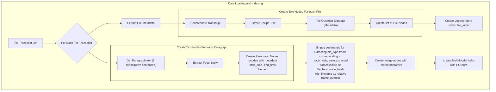
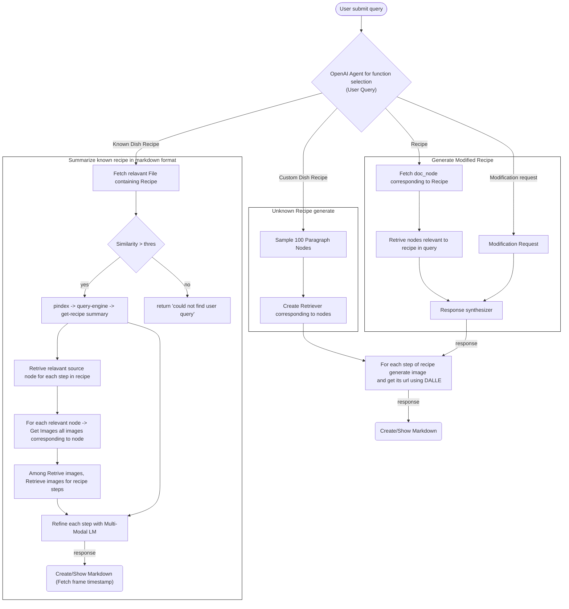

### Start the postgres database 
1. `cd ./postgres`

2. `docker compose up -d`


### Add file .env with

``` 
OPENAI_API_KEY=sk-Vs3f..
ANTHROPIC_API_KEY=sk-ant..
DEEPGRAM_API_KEY=43af..
```


### Architecture
#### Index creation


#### Response generation
